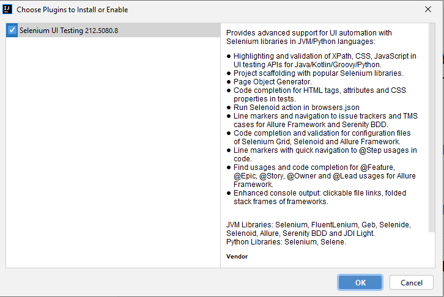
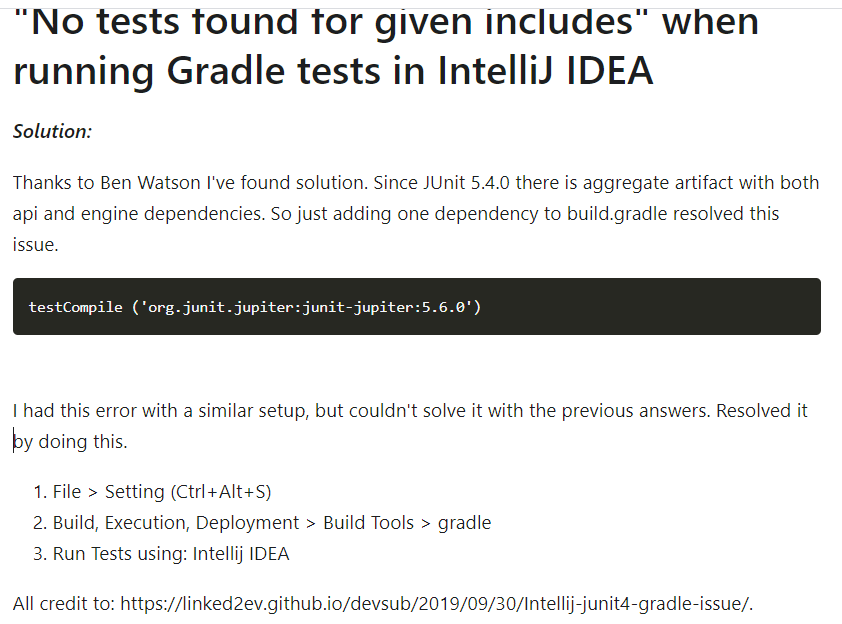

### 1 Žingsnis 
Įsirašyti IntelliJ IDEA ir sukurti Gradle Java Projektą.

### 2 Žingsnis
Įsidiegti reikiamas bibliotekas

#### Pagrindinė darbui su Selenium WebDriver.
https://mvnrepository.com/artifact/org.seleniumhq.selenium/selenium-java
#### Cucumber Karkasas ir sąrašas bibliotekų BDD testų scenarijams rašyti
1. Java kalbos core dependency:
https://mvnrepository.com/artifact/io.cucumber/cucumber-java
2. Cucumber core dependency:
https://mvnrepository.com/artifact/io.cucumber/cucumber-core
3. JUnit dependency: 
https://mvnrepository.com/artifact/io.cucumber/cucumber-junit
#### Supaprastinti trumpesni metodai pvz. naudojant JUnit
https://mvnrepository.com/artifact/org.hamcrest/hamcrest

(Multi-threaded | Parallel Cucumber-JVM | Parallelize your Java Cucumber tests on a feature level or on a scenario level.)
4. Jeigu norime lygiagreciai paleisti testus, galime naudoti šią biblioteką
   https://mvnrepository.com/artifact/io.github.prashant-ramcharan/courgette-jvm

### 3 Žingsnis

Naudojame IntelliJ vadovaujames sufleriais ir trumpiniais bei siulomais plugins
Selenium UI automatiskai pasiule tai naudosim :) apacioje paveikslelis

Atsisiunčiam draiverius priklausomai kokią naršyklę naudosime testams
Firefox:
https://github.com/mozilla/geckodriver/releases

### Scenarijų pavyzdziai Cucumber
https://reports.cucumber.io/

mokintis
https://cucumber.io/docs/guides/10-minute-tutorial/

#### Testavimo Pavyzdziai su papildoma biblioteka naudojant courgette-jvm 
Startinis pvz. \
https://github.com/h3xh4wk/gradle_selenium \
Daugiau pvz. \
https://github.com/prashant-ramcharan/courgette-jvm

### COMMON PROBLEMS 

#### kartais reikia prideti ir sia biblioteka
#### testImplementation 'org.slf4j:slf4j-simple:2.0.0-alpha5'

